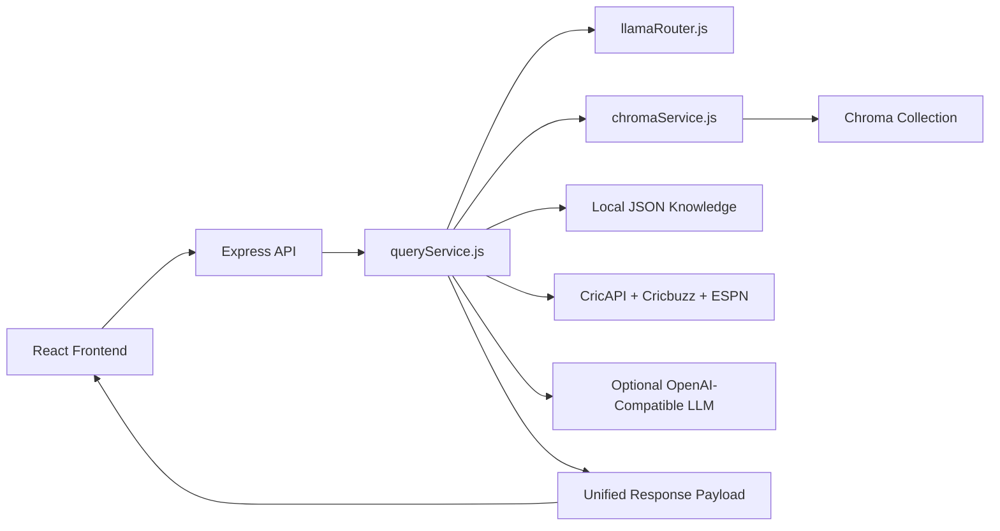

# Cricket Chat Bot Backend

Express backend for the Cricket Chat Bot. It serves the frontend build, exposes cricket APIs, routes natural-language questions, reads the local Chroma semantic archive, enriches player entities through provider APIs, and pushes live match alerts through Socket.IO.

## Architecture

The backend now has one archive source of truth: ChromaDB. Player profiles, team summaries, match summaries, and semantic cache entries are stored and read through `chromaService.js`.



## Main Capabilities

- `POST /api/query` for natural-language cricket questions
- `GET /api/query/stream` for Server-Sent Events query progress
- Chroma-backed player, team, match, and leaderboard lookups
- Chroma-backed semantic cache for stable repeat questions
- Static cricket rules, records, terms, history, and equipment knowledge
- CricAPI live scores, schedules, series, and player directory endpoints
- Cricbuzz player micro-cards with local profile fallback
- ESPN profile fallback enrichment
- Socket.IO live alerts
- Direct completed-match upserts into Chroma through the live ingestor

## Tech Stack

- Node.js + Express
- Socket.IO
- ChromaDB
- Python helper scripts for local Chroma reads, writes, and rebuilds
- Axios
- CricAPI
- Cricbuzz RapidAPI
- Optional local or cloud OpenAI-compatible chat endpoint

## Project Structure

```text
backend/
  server.js                         Express app, API routes, static hosting, Socket.IO
  queryService.js                   Main natural-language query orchestration
  llamaRouter.js                    Query intent routing and action selection
  llamaClient.js                    Local and cloud OpenAI-compatible client helpers
  chromaService.js                  Chroma query, collection, cache, and upsert boundary
  vectorIndexService.js             Chroma-backed player, team, match, and leaderboard helpers
  knowledgeService.js               Static knowledge lookup from JSON files
  cricApiService.js                 CricAPI and Cricbuzz provider integration
  espnService.js                    ESPN player profile fallback integration
  playerProfileService.js           Player profile metadata and Wikipedia enrichment
  queryParser.js                    Entity parsing and route helper logic
  sessionStore.js                   In-memory query session context
  data/                             Local cricket knowledge JSON files
  scripts/
    build_clean_dataset.py          Builds cleaned ball-by-ball CSV from raw cricket JSON
    build_chroma_local.py           Builds Chroma documents directly from the cleaned CSV
    chroma_collection_local.py      Local Chroma collection get/upsert helper
    query_chroma_local.py           Local Chroma query helper
    semantic_cache_local.py         Local semantic-cache query/upsert helper
    scrape_match.py                 Optional scorecard scraper fallback
  workers/dailyIngestor.js          Live completed-match ingestor that upserts match docs into Chroma
```

## Requirements

- Node.js 18 or newer
- npm
- Python 3.x for local Chroma helper scripts and archive rebuilds
- ChromaDB Python package for local rebuild/query helpers
- Optional provider keys for live data and enrichment

## Installation

```powershell
cd "d:\projects\cricket chat bot\backend"
npm install
```

## Environment

Create `backend/.env` from `backend/.env.example`, then set only the providers you use.

```env
PORT=3001

CHROMA_MODE=auto
CHROMA_DB_DIR=
CHROMA_COLLECTION=cricket_semantic_index
CHROMA_PYTHON_BIN=python
CHROMA_HELPER_TIMEOUT_MS=30000
CHROMA_DEBUG=false

SEMANTIC_CACHE_COLLECTION=semantic_cache
SEMANTIC_CACHE_DISTANCE_THRESHOLD=0.05
SEMANTIC_CACHE_MIN_QUESTION_SIMILARITY=0.92
SEMANTIC_CACHE_MIN_TOKEN_OVERLAP=0.75

CRICAPI_KEY=
CRICAPI_TIMEOUT_MS=10000

CRICBUZZ_ENABLED=true
CRICBUZZ_RAPIDAPI_KEY=
CRICBUZZ_RAPIDAPI_HOST=cricbuzz-cricket.p.rapidapi.com
CRICBUZZ_BASE_URL=https://cricbuzz-cricket.p.rapidapi.com/
CRICBUZZ_TIMEOUT_MS=12000

LLM_ENDPOINT=http://localhost:8080/v1/chat/completions
LLM_MODEL=local
LLM_TIMEOUT_MS=30000
OPENAI_API_KEY=
OPENAI_MODEL=gpt-4o
OPENAI_ENDPOINT=https://api.openai.com/v1/chat/completions

ENABLE_DAILY_INGESTOR=true
INGEST_INTERVAL_MS=3600000
INGEST_LOOKBACK_HOURS=24
INGEST_MATCH_LIMIT=10
RUN_DAILY_INGESTOR_ON_BOOT=false
```

## Running Locally

```powershell
cd "d:\projects\cricket chat bot\backend"
npm start
```

With the recommended `.env`, the server runs at:

```text
http://localhost:3001
```

If the frontend build exists at `../frontend/dist`, the backend serves it. During development, run the frontend Vite server separately.

## Available Scripts

```powershell
npm start
npm run test:cases
npm run test:cricapi
npm run dataset:clean
npm run chroma:build
npm run rebuild:all
npm run chroma:query -- --query "Virat Kohli"
```

| Script | Purpose |
| --- | --- |
| `npm start` | Starts the Express and Socket.IO server |
| `npm run test:cases` | Runs smoke coverage for routing and response shapes |
| `npm run test:cricapi` | Exercises CricAPI endpoints against a running backend |
| `npm run dataset:clean` | Builds `cleaned_balls_all_matches.csv` from raw cricket JSON |
| `npm run chroma:build` | Rebuilds the local Chroma collection directly from the cleaned CSV |
| `npm run rebuild:all` | Alias for the Chroma rebuild path |
| `npm run chroma:query` | Runs a local Chroma query helper |

## Chroma Archive

`scripts/build_chroma_local.py` builds three document types directly into the Chroma collection:

- `player_profile`
- `team_summary`
- `match_summary`

The generated manifest is `chroma_manifest.json`, and `/api/status` reports that manifest plus a Chroma health probe.

Generated local archive artifacts are intentionally not committed:

```text
chroma_db/
chroma_manifest.json
cleaned_balls_all_matches.csv
cleaned_dataset_manifest.json
```

## API Reference

### `GET /api/status`

Returns Chroma readiness, manifest counts, dataset summary, and health probe details.

Example shape:

```json
{
  "status": "ready",
  "source": "chroma",
  "db_dir": "path-to-chroma-db",
  "collection": "cricket_semantic_index",
  "counts": {
    "documents": 0,
    "players": 0,
    "teams": 0,
    "matches": 0
  },
  "summary": {},
  "chroma_health": {}
}
```

### Query and Archive Endpoints

| Method | Endpoint | Purpose |
| --- | --- | --- |
| `GET` | `/api/about` | Status plus dataset build dates |
| `GET` | `/api/home` | Dashboard summary, leaders, and recent matches |
| `GET` | `/api/options` | Team, season, and venue filters |
| `GET` | `/api/players/search` | Chroma-backed player search |
| `GET` | `/api/players/:id` | Player profile |
| `GET` | `/api/players/:id/summary` | Player stat summary |
| `GET` | `/api/teams/search` | Chroma-backed team search |
| `GET` | `/api/matches` | Chroma-backed match listing |
| `GET` | `/api/matches/:id` | Match summary |
| `POST` | `/api/query` | Main natural-language query endpoint |
| `GET` | `/api/query/stream` | Streaming query endpoint |

### Provider Endpoints

| Method | Endpoint | Purpose |
| --- | --- | --- |
| `GET` | `/api/cricapi/live-scores` | Live and recent scores |
| `GET` | `/api/cricapi/players/search` | CricAPI player directory search |
| `GET` | `/api/cricapi/players/:id` | CricAPI player profile |
| `GET` | `/api/cricapi/schedule` | Match schedule |
| `GET` | `/api/cricapi/series` | Series search |
| `GET` | `/api/cricapi/series/:id` | Series details |
| `GET` | `/api/cricbuzz/player-card` | Cricbuzz-backed entity micro-card |

## Query Response Shape

The frontend expects a normalized response:

```json
{
  "type": "comparison",
  "title": "Virat Kohli vs Rohit Sharma",
  "image": "",
  "summary": "Short answer shown in the response card.",
  "stats": {},
  "extra": {
    "action": "compare_players",
    "sources": ["Vector Archive"],
    "detected_entities": []
  },
  "detected_entities": []
}
```

## Live Ingestion

`workers/dailyIngestor.js` polls live provider data when enabled. For completed matches it:

1. checks whether a match document already exists in Chroma
2. fetches scorecard context from CricAPI or scraper fallback
3. builds a semantic match narrative
4. upserts one `match_summary` document into Chroma
5. clears Chroma read caches
6. emits Socket.IO alerts when useful

It does not maintain a secondary archive store.

## Testing

```powershell
cd "d:\projects\cricket chat bot\backend"
npm run test:cases
```

The smoke suite validates:

- live query routing
- Chroma-backed player and team questions
- rules, history, and record answers
- comparison responses
- missing-Chroma degraded behavior
- match lookup helpers

## Troubleshooting

### Chroma Missing

Check:

```text
GET /api/status
```

Then rebuild:

```powershell
npm run chroma:build
```

### Live Provider Missing

Set `CRICAPI_KEY` in `backend/.env`. Archive and static knowledge queries continue to work without live provider keys.

### Local LLM Missing

The backend can still answer deterministic archive and knowledge questions. For routed reasoning or synthesis, start an OpenAI-compatible local server and set `LLM_ENDPOINT`.

## Example Questions

- `Virat Kohli stats`
- `India team summary`
- `India vs Australia head to head`
- `Compare Rohit Sharma vs Virat Kohli`
- `Highest individual score in ODI`
- `Who won the 2011 World Cup?`
- `What is LBW?`
- `Show recent live scores`
